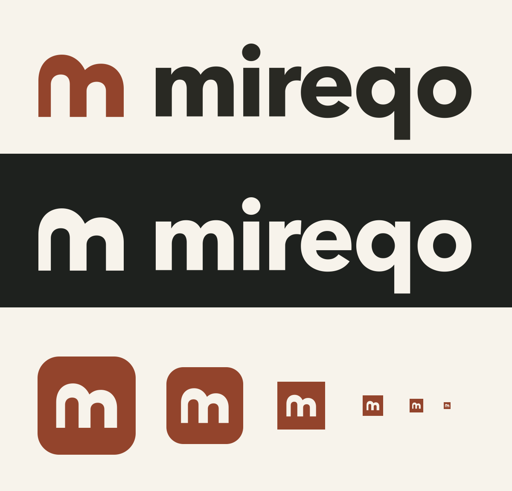
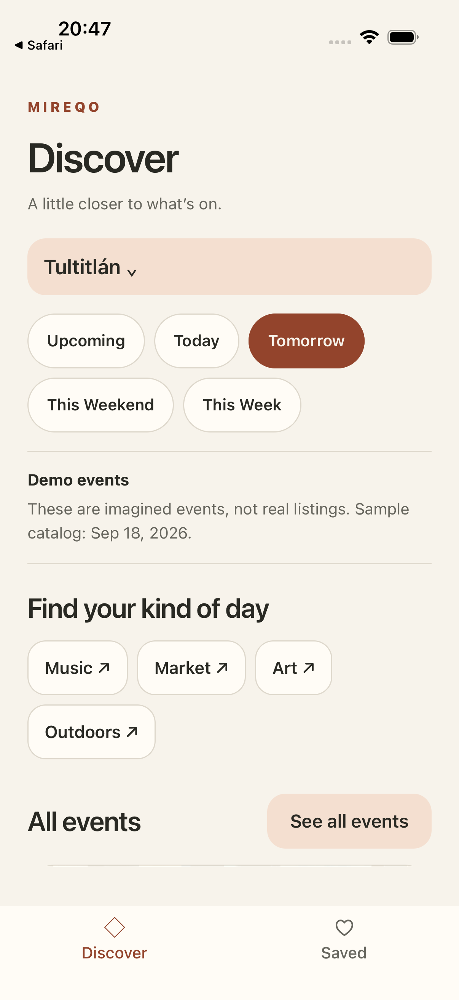
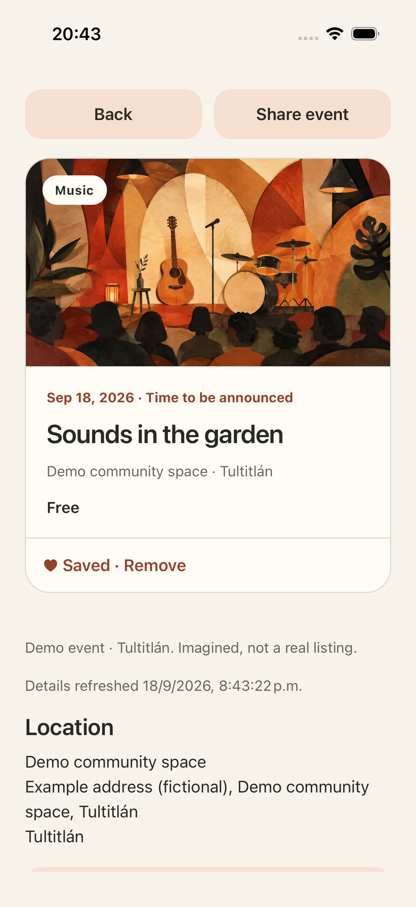
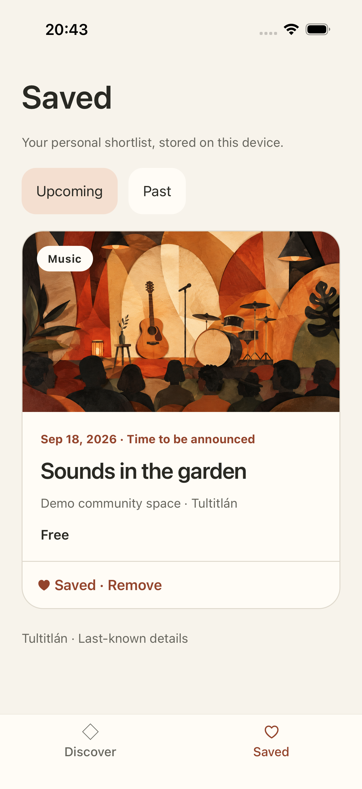

# Mireqo — product webpage handoff

Draft · 2026-09-19 · Based on the application at revision `63e1306`.

## Assignment

Build a single-page website introducing **Mireqo**, a mobile app for discovering events in your area or a selected city. Explain its main features through concise copy and the supplied real in-app screenshots.

The priorities are **mobile first, responsive design, and concision**. A visitor should understand what Mireqo does within a few seconds. This is a product introduction, not a browser version of the app.

This brief references shared repository assets in [`assets/brand/`](../../assets/brand/) and [`assets/screenshots/`](../../assets/screenshots/). When handing it to another agent, provide those directories together with this document, preserving their repository-relative layout, or give the agent access to the repository. The handoff folder intentionally contains only this spec. Implement in the destination project chosen by the owner; use its existing conventions. This document does not authorize changes to the Mireqo mobile app, a deployment, or a new backend.

## Product facts and claim boundaries

- Mireqo is being developed for Android and iOS. No public release date or app-store links have been supplied.
- Current features: manual area selection; date shortcuts; category and event-collection browsing; event details; saving and removing events; Upcoming/Past saved groups; locally stored saved information that remains readable offline; native sharing; and external location/event-page actions when available.
- Initial coverage is **Coacalco and Tultitlán in Estado de México, plus all of Mexico City**. Do not imply coverage throughout Estado de México or throughout Mexico.
- Browsing does not require an account or precise location permission. This does not mean automatic GPS discovery is implemented.
- Current listings are fictional development examples. Screenshots show demonstration data, not real events, current availability, or ticket offers.
- Offline access applies to previously saved information. New discovery and refreshed information require a connection. Saving is on the device, not account-based synchronization.
- The app supports light and dark appearance. Search, advanced filters, interests, Settings, and live event sources remain future work; do not promote them as available features.
- Mireqo does not sell tickets. Do not invent ratings, testimonials, user counts, partners, pricing, a waitlist, contact details, or download destinations.

Keep these distinctions in the implementation brief; the public page needs only the short development/demo disclosure below, not a long roadmap or disclaimer section.

## Page structure and ready-to-use copy

Use English for this first page, matching the supplied app screens. Keep public copy under **250 words**, excluding text inside screenshots and accessibility descriptions. The following copy is the default; light editorial improvements may preserve its meaning.

### 1. Compact header

Use the approved **Open City** logo supplied as [mireqo-logo.svg](../../assets/brand/mireqo-logo.svg): the terracotta twin-arch “m” symbol and outlined charcoal `mireqo` wordmark. Link it to the top of the page with the accessible name “Mireqo — home.” Do not replace it with typeset text or invent another symbol. Display it around 140–176px wide, preserving its 4:1 aspect ratio.

Optional navigation: **Features** → `#app`, **Coverage** → `#coverage`. Keep these visible and simple on mobile; no hamburger menu is needed for two links.

### 2. Hero

Eyebrow: **Local event discovery**

Heading: **Good things are close by.**

Description: **Mireqo helps you discover things to do, explore the details, and save the events you want to come back to.**

Primary action: **See how it works** → `#app`.

Supporting line: **In development for iOS and Android.**

Give the heading clear prominence. Keep the introduction short enough that the beginning of the app preview is visible near the first screen on a typical phone. Do not add inactive store badges or a fake “Download” button.

### 3. Feature previews (`id="app"`)

Section heading: **Discover. Explore. Save.**

Build three visual feature cards, each combining its screenshot, heading, and benefit. These are the main feature explanation; do not repeat them in another grid further down the page.

| Screenshot                                                      | Heading                            | Supporting copy                                                                                               |
| --------------------------------------------------------------- | ---------------------------------- | ------------------------------------------------------------------------------------------------------------- |
| [discover.png](../../assets/screenshots/discover.png)           | **Find something for your day.**   | Choose an area, browse categories, and explore events for today, tomorrow, or the weekend.                    |
| [event-details.png](../../assets/screenshots/event-details.png) | **Get the details before you go.** | Check dates, venue, price, and event information. Share a find or open available location and event links.    |
| [saved.png](../../assets/screenshots/saved.png)                 | **Keep your next outing close.**   | Save events to a personal shortlist, browse Upcoming and Past, and read previously saved information offline. |

Place this visible caption directly beside or beneath the previews: **Actual development screens. Events shown are fictional examples.**

Screenshots are static previews, not interactive copies of the app. Their embedded buttons should not be recreated as webpage controls. Each screenshot may link to its full-size image so visitors can inspect it.

### 4. Coverage and footer (`id="coverage"`)

Heading: **Starting close to home.**

Copy: **Initial coverage: Coacalco and Tultitlán in Estado de México, plus all of Mexico City. Browse without an account or precise location permission.**

Use [mireqo-mark.svg](../../assets/brand/mireqo-mark.svg) as a small decorative footer mark beside: **Mireqo — a little closer to what’s on.** Hide the decorative image from screen readers when the adjacent text already identifies the brand.

No additional closing sales pitch, signup form, FAQ, blog, or repeated call to action is needed.

## Visual direction

Extend the app’s warm editorial style: generous whitespace, clear typography, softly rounded surfaces, restrained borders, and a terracotta accent. The supplied app imagery should carry the visual story. Avoid unrelated stock photos, dashboard styling, decorative gradients, and oversized device mockups.

Use these existing Mireqo colors as the starting palette:

| Role           | Color     |
| -------------- | --------- |
| Background     | `#F7F3EB` |
| Surface        | `#FFFCF6` |
| Primary text   | `#292923` |
| Secondary text | `#67665E` |
| Accent         | `#93442C` |
| Soft accent    | `#F4DFD0` |
| Border         | `#DED8CC` |

Use a legible system sans-serif or the destination project’s existing font for page copy. The supplied logo already contains outlined lettering and requires no font download. The webpage may use a single light theme; an additional theme switcher is not required. Favor subtle borders and a small shadow around screenshots over heavy ornamental phone frames.

## Approved logo and favicon — required

The owner selected **option 2: Open City**. Its paired archways form an “m” and suggest welcoming places to explore. Use the production vector assets in [`assets/brand/`](../../assets/brand/); the earlier concept sheet is not a production logo.

| Use                                | Required asset                                                              |
| ---------------------------------- | --------------------------------------------------------------------------- |
| Header on the cream/light page     | [mireqo-logo.svg](../../assets/brand/mireqo-logo.svg)                       |
| Logo on a dark background, if used | [mireqo-logo-on-dark.svg](../../assets/brand/mireqo-logo-on-dark.svg)       |
| Compact/footer symbol              | [mireqo-mark.svg](../../assets/brand/mireqo-mark.svg)                       |
| Modern browser favicon             | [favicon.svg](../../assets/brand/favicon.svg)                               |
| Fallback favicon                   | [favicon.ico](../../assets/brand/favicon.ico) (16, 32, and 48px entries)    |
| Apple home-screen bookmark         | [apple-touch-icon.png](../../assets/brand/apple-touch-icon.png) (180 × 180) |

Copy the required files from `assets/brand/` into the destination website's public assets. Repository-relative source paths below are not public website URLs. The following assumes these files are served from the site root; adjust every URL consistently for a subdirectory deployment:

```html
<link rel="icon" href="/favicon.svg" type="image/svg+xml" sizes="any" />
<link rel="icon" href="/favicon.ico" sizes="16x16 32x32 48x48" />
<link rel="apple-touch-icon" href="/apple-touch-icon.png" sizes="180x180" />
<meta name="theme-color" content="#93442C" />
```

[site.webmanifest](../../assets/brand/site.webmanifest) and its 192/512px icons are also included for optional browser home-screen metadata. If using the manifest, copy its referenced images alongside it and add a `rel="manifest"` link. This does not request a service worker, an install prompt, offline webpage behavior, or a web version of the mobile app.

Preserve logo colors, proportions, and clear space. Do not recolor through CSS filters, stretch, redraw, add shadows/gradients, or use the wordmark inside a tiny favicon. The favicon uses only the approved arch symbol. See the [brand guide](../../assets/brand/brand-guide.md) for the complete website/app asset map, variants, and integration notes.



This preview is for implementation reference; it is not an additional public webpage section. The supplied app screenshots predate the new identity; retain them unchanged and do not claim the logo is already installed in those builds.

## Mobile-first and responsive behavior

- Start at **320px** viewport width. Use 16–24px side padding, body text around 16px, comfortable line spacing, and fluid headings that never overflow.
- On phones, keep the hero and coverage single-column. Present the three feature previews in a horizontally scrollable, scroll-snapping strip contained within the page. Show a glimpse of the next card and a short “Swipe to explore” hint. All three cards must remain reachable by touch and keyboard; do not auto-advance.
- At approximately **768px and wider**, show the three preview cards as a grid without horizontal scrolling. Adjust the breakpoint if needed to preserve useful screenshot size and readable captions.
- At wide desktop sizes, cap the main content near **1120px** and center it. Do not stretch screenshots to fill the viewport.
- Preserve each screenshot’s full aspect ratio and visible content. Use contained images with reserved dimensions. No horizontal page overflow, overlapping copy, or fixed-height text containers.
- Keep screenshots roughly 220–300px wide where space permits. A full-size image link provides access to small in-app text without making the webpage excessively tall.

## Screenshot assets

Three original, unmodified iOS simulator captures are available in [`assets/screenshots/`](../../assets/screenshots/). Each PNG is **1206 × 2622**. Their use illustrates the shared app experience; it does not imply Android screenshots were captured here.

| File                                                            | Suggested alternative text                                                                            | Original repository source                                  |
| --------------------------------------------------------------- | ----------------------------------------------------------------------------------------------------- | ----------------------------------------------------------- |
| [discover.png](../../assets/screenshots/discover.png)           | Mireqo Discover in Tultitlán, showing date shortcuts and event categories.                            | `plans/event-details-saved/ios-date-back-tabs-retained.png` |
| [event-details.png](../../assets/screenshots/event-details.png) | Mireqo event details showing a demo music event, its date, venue, price, and Save and Share controls. | `plans/event-details-saved/ios-detail-saved.png`            |
| [saved.png](../../assets/screenshots/saved.png)                 | Mireqo Saved with Upcoming and Past tabs and a saved demo music event.                                | `plans/event-details-saved/ios-saved-upcoming.png`          |

Use these assets rather than fabricated UI mockups. Do not repaint, replace text, remove demo labels, or change dates inside them. These are dated development previews, not a live event feed. Keep original PNGs available; web-optimized copies are allowed if they preserve content and readability. Use local asset paths in the delivered website, not repository filesystem paths or third-party image hotlinks.

| Discover                                                   | Event details                                                        | Saved                                                |
| ---------------------------------------------------------- | -------------------------------------------------------------------- | ---------------------------------------------------- |
|  |  |  |

## Accessibility, performance, and functionality

- Use semantic header, navigation, main, sections, figures/captions, and footer; one H1 with logical heading order.
- Provide meaningful image alternatives, visible keyboard focus, accessible link names, and at least 44px touch targets for controls. Verify normal-text contrast of at least 4.5:1.
- Screenshot links must identify the screen and that they open a full-size image. Do not require a lightbox; a normal image link is sufficient.
- Support 200% text zoom and reduced-motion preferences. No parallax or autoplay media. All informational content must remain available without JavaScript.
- Load above-the-fold imagery normally; lazy-load below-the-fold screenshots. Reserve image dimensions to prevent layout shifts and provide suitable optimized sizes without sacrificing text readability.
- Set a page title such as **Mireqo — Discover local events** and a concise description based on the hero. Do not invent a production URL, canonical domain, tracking IDs, or social accounts.
- This is a static product page. No live catalog connection, database, accounts, analytics, newsletter service, or backend is required. Keep dependencies proportionate and follow the destination project’s setup.

## Acceptance and delivery

The receiving agent should deliver the webpage in its destination project and report how to preview it, what was checked, and any remaining limitations. Do not deploy unless the owner separately requests it.

Before delivery, verify:

1. The page communicates Mireqo’s purpose immediately and includes all three supplied screenshots with concise feature explanations.
2. The development/demo disclosure and exact initial geography remain visible and accurate; no unavailable feature or public release is implied.
3. Layouts work at 320, 390, 768, and 1440px widths, including 200% text zoom, with no page overflow or clipped copy.
4. Touch and keyboard users can reach every feature card, navigation destination, and full-size screenshot; focus is visible.
5. Images load locally, maintain their proportions, and remain useful at the displayed size. Links have real destinations; no placeholder `#` actions remain.
6. Copy stays within the word budget, browser errors are absent, and the page does not depend on a running Mireqo API.
7. The header uses the approved SVG logo, the footer uses its matching symbol, and the browser tab shows the arch favicon. Check favicon and touch-icon URLs directly at the actual deployment base path; no missing assets or substitute logos remain.

## Reference context

This brief summarizes `spec/high-level-spec.md`, `spec/feature-spec.md`, `spec/ui-spec.md`, current implementation notes in `architecture.md`, and `apps/mobile/src/ui/theme.ts`. The product specifications include future scope; the claim boundaries in this handoff describe the implemented preview as of the date above. The receiving agent does not need access to those files to complete this webpage.
